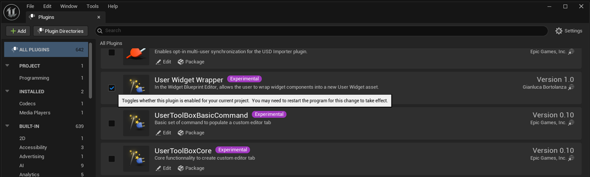
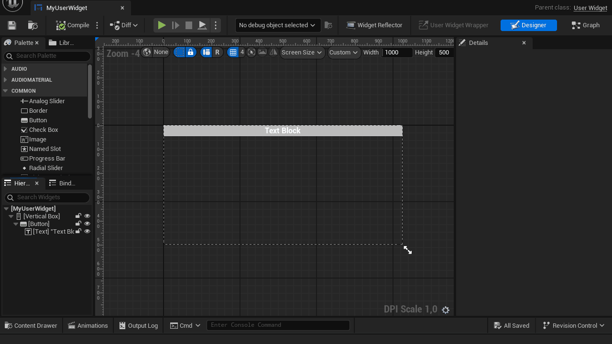

# User Widget Wrapper
A small tool for Unreal Engine 5 that lets you wrap widget components in the Widget Blueprint Editor into a new User Widget.

## Installing the Plugin

Simply put the content of the plugin in `YourProjectFolder/Plugins/`, check latest releases for pre-compiled binaries.

## Enabling the Plugin in your Project

Enable the plugin in your project `Edit -> Plugins` and restart the editor.

## How it works

1. Open any widget with the Widget Blueprint Editor
2. Select one or more widget components on the Hierarchy that have the same root
3. Click on the User Widget Wrapper button on the toolbar
4. Select a class that inherits from the User Widget class
5. Select the path where you want to create the new User Widget that will contain the selected components 

Once you have done that, the widget components that you have selected will be moved to the new User Widget asset and on the slot where they were instanciated on the widget they got removed from, the newly created User Widget will be placed.
